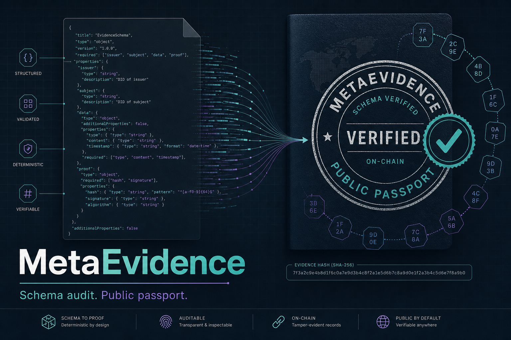

# MetaEvidence

<p align="center">
  
</p>

<p align="center">
  <strong>Schema audit. Public passport.</strong>
</p>

<p align="center">
  <a href="https://github.com/valentinzubok/MetaEvidence/actions/workflows/ci.yml"></a>
  <a href="LICENSE"></a>
  <a href="https://valentinzubok.github.io/MetaEvidence/"></a>
</p>

## Overview

**MetaEvidence v0.2** registers JSON schemas and freezes **live HTTPS pages** (`get_webpage` → SHA-256) under `eq_principle_strict_eq`, then audits by re-fetching + schema-checking metadata.

```
register_schema → attach_evidence (freeze) → audit → valid | invalid → appeal (max 3)
```

### Why GenLayer

Validators independently fetch the same `source_url`. Consensus is on the digest + schema report — not a self-attested hash. Same optimistic-democracy path as [EvidenceHub](https://github.com/valentinzubok/EvidenceHub).

## Install

```bash
git clone https://github.com/valentinzubok/MetaEvidence.git
cd MetaEvidence
pip install -r requirements-dev.txt
coverage run -m pytest -q && coverage report -m
```

Studio: paste [`contracts/MetaEvidence.py`](contracts/MetaEvidence.py).

## API

See [`docs/API.md`](docs/API.md).

## Demo

- **Static flow mock:** https://valentinzubok.github.io/MetaEvidence/
- **Project app (Studionet):** https://metaevidence-console.vercel.app (`web/` — Next.js + MetaMask + genlayer-js)

```bash
cd web && npm install && npm run dev   # http://localhost:3001
```

Deploy `web/` to Vercel for Portal **Projects** submission — see [`PROJECT_SUBMIT.md`](PROJECT_SUBMIT.md).

## License

MIT © 2026 Valentyn Zubok.
